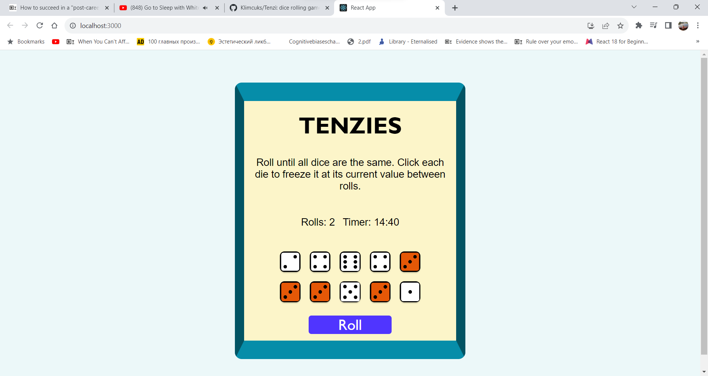
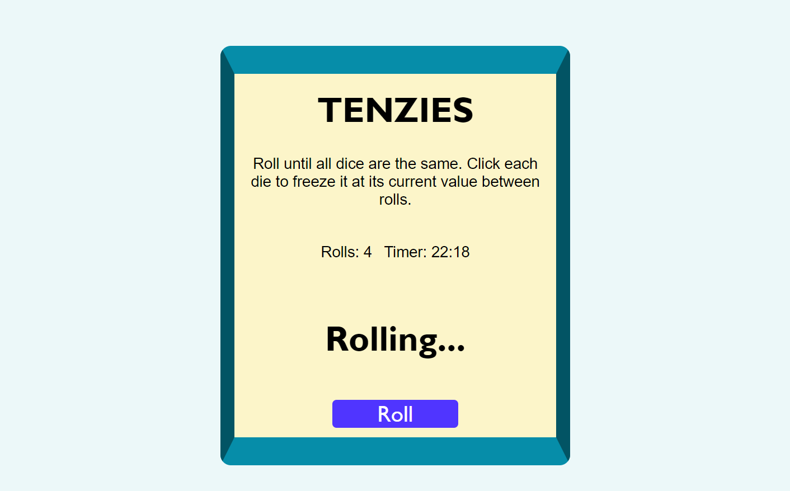
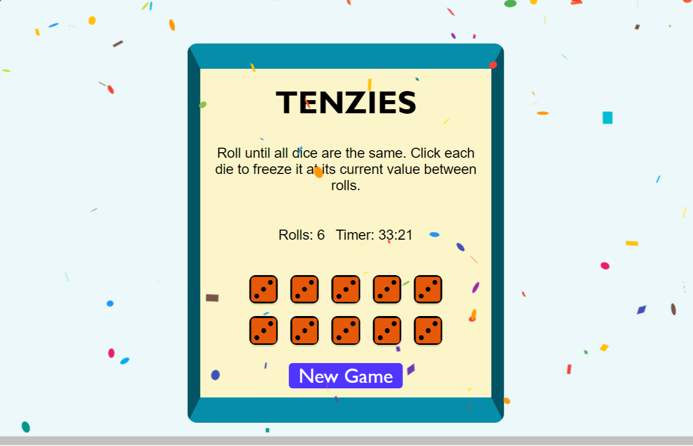

# Tenzi
 - A dice rolling game in which a player rolls the dice with an objective to roll all ten dice to the same number
## General information
 - This was built as my personal project in my final week at the Boolean Course
### Tech Stack
 - Front-end: HTML, CSS, ReactJS
#### Screenshots of the challenge

Here are some screenshots of the challenge:

### <a href="https://tenzi-six.vercel.app/">View the project</a>
